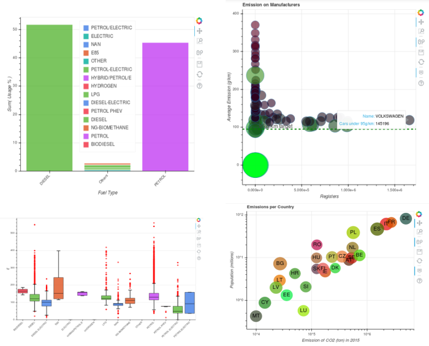

# Analysis of CO² Emissions on Passenger Cars at the E.U. Contries, Year 2015

#### The Regulation (EC) No 510/2011 of the European Union requires that all member states report annualy info about the registrations of new cars including data like Manufacturer, Commercial Name, CO² emissions, Weight, Fuel Type and others. This is a analysis of the data collected on 2015, available at http://www.eea.europa.eu/data-and-maps/data/co2-cars-emission-11.

This project is a analysis of the data provided by the E.U.

### View at: https://pentalpha.github.io/eu-car-emissions-analysis-2015/

Jupyter Notebook with was used to code the scripts and describe the data.

Dependencies:

- Python3
- Bokeh
- Numpy
- Pandas
- IPython

The results found include biggest and lowest emitters of CO², the popularity of each fuel type, the emission rates distribution of each fuel type, the emission rates of the manufacturers and the annual emissions of the cars registered at 2015 by country.

Some of the graphs created:

